# 오아시스 프로젝트: 식품사막화 해소를 위한 이동식 마트 최적 경로 설정
중앙대학교 데이터분석 학회 DartB 2024-1 제2회 학술제(2024.05.29.) 참가 프로젝트(오아시스 팀)

## 프로젝트 개요
### 기획 의도 및 목표
* 식품 사막이란? 일상적으로 걸어다닐 수 있는 거리 안에서, 인스턴트나 냉동이 아닌, 진짜 '신선식품'을 구하기가 어려워진 지역. 사막에서 몇시간 걸어가야 물을 구할 수 있듯이, 수십분을 걸어가야 신선식품을 겨우 구할 수 있는 상황.
* 도시슬럼화, 지방소멸, 고령화 등이 원인으로, 해외에서는 이미 1990년대에 보고된 개념이며, 한국에서도 식품 사막화 현상이 사회문제로 대두.
* 도시 지역의 경우, 유통의 발달로 문제를 일부 해결할 수 있는 상황.
* 하지만 농촌 지역의 경우 유통 서비스 접근성조차 좋지 않음. 따라서 인구 감소로 인해 마트와 슈퍼가 줄폐업하거나, 유통기한이 짧은 신선재료를 팔지 않는 현 상황에 대처하기 어려움.

* 따라서 본 프로젝트에서는, 관련 데이터를 통해
  1. 유통 서비스마저 제공되지 않는 국내 식품사막의 현황을 분석하고
  2. 해소할 방법을 발견하고자 함.

### 프로젝트 기간
* 총 소요 기간 : 2024.05.01. ~ 2024.05.29.
* 중간발표 : 2024.05.22.
* 최종발표 : 2024.05.29.

### 팀원 구성
김지민(3기), 김지인(2기), 김현서(2기), 이동준(3기)

## 프로젝트 설명
### 분석 환경
* Python(Colab, Jupyter Notebook)
  * 사용 라이브러리:
pandas,
numpy,
matplotlib,
seaborn,
folium,
geopandas,
networkx,
osmnx,
shapely,
pulp,
sklearn,
scipy,
ortools
* Tableau

### 데이터셋
* 강원도 인구 데이터: 국토통계_인구정보-총인구수(전체)-(격자)1KM_강원특별자치도_202310 (출처: 국토정보맵)
* 강원도 상가 데이터: 소상공인시장진흥공단_상가(상권)정보 (출처: 소상공인시장진흥공단)
  * 식료품점 데이터 추출: <표준산업분류명 - 채소, 과실 및 뿌리작물 / 소매업, 슈퍼마켓, 육류 /소매업> 필터링
  * 편의점 데이터 제거: 상호명이 편의점인 데이터 필터링

### 분석 과정
1. 데이터 전처리
2. 기초 EDA 후 세부 분석 지역 선정
3. 행정 구역 세분화 및 분석
4. 해결 방안 제시(이동식 마트)
5. MCLP를 이용한 최적 정차 위치 선정
5. 최적 경로 모델링

### 분석 결과
1. 1차 분석
   * 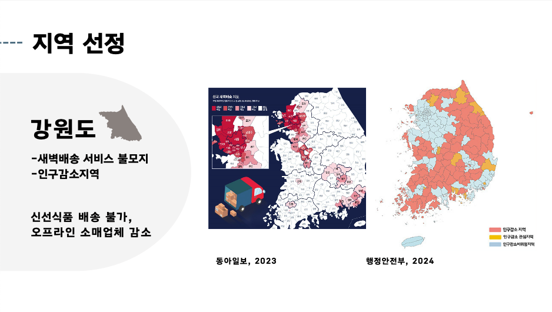
   * 전국 광역지자체 중 새벽배송 불모지이자 인구감소지역인 강원도 선정
   * 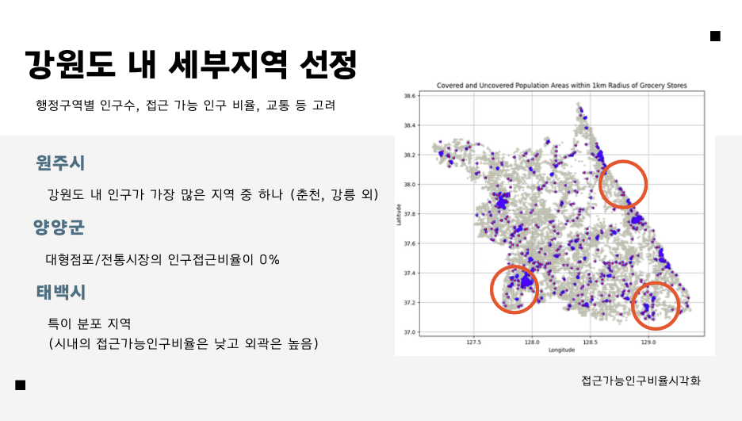
   * 분석 리소스의 한계로, 강원도 중 일부 시군구(태백, 양양, 원주) 선정

2. 기존 식료품점의 인구 커버율 분석
   * 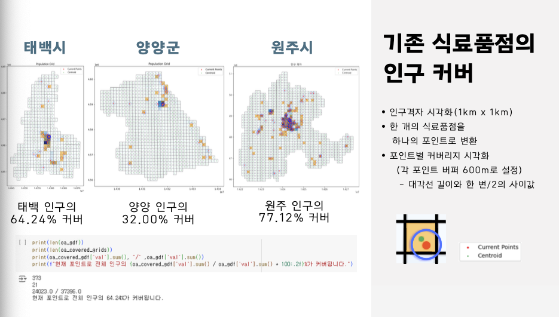
   * 공간 데이터 기법을 활용.
   * 식료품점 포인트로부터 600m의 버퍼를 geo_pandas로 생성.
   * 600m인 이유: 정확한 선행 연구가 없고, 1km 격자의 한계를 고려하여 설정.
   * 버퍼가 인구격자의 중심점을 포함할 경우, 해당 인구 격자의 인구를 모두 커버한다고 가정.
   * 커버하는 인구수와, 면적을 산출
   * 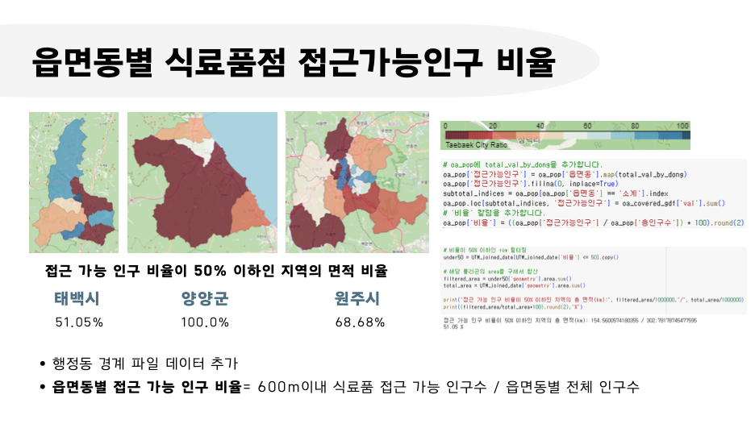
   * 대상 시군구의 읍면동별 세부 분석 시행.
   * 접근 가능 인구 비율이 50% 이하인 지역(식품 사막) 추가 산출
   * 태백시의 경우 면적의 51%를 식품 사막 지역이었으며, 양양군의 경우 100%, 원주시의 경우 68.68%가 식품 사막 지역이었음.

3. 해결방법 제안: 이동식 마트
   * 새벽배송 등, 신속한 신선식품 유통이 비수도권에 안착할 때까지 정부 차원의 대책 필요.
   * 일부 선진 사례(포천 농협 등)에서 착안해, 이동식 마트를 제안.
   
4. MCLP 알고리즘을 이용한 최적 정차 위치 선정
   * MCLP 알고리즘이란? MCLP(Maximal Covering Location Problem)는 x개의 시설과 후보지점이 주어질 때, 목적함수와 제약조건을 이용해
     시설의 영향력이 미칠 수 있는 영역을 최대화하도록 시설을 배치하는 방법론
   * 목적식: 인구격자를 최대로 커버하여, 커버되는 인구수를 최대화하도록
     신규 식료품점의 입지를 선정
   * 제약식:
     * (1) 인구격자 i는 신규 식료품점의 커버 범위 안에서 하나 이상의 신규 식료품점에 의해 커버된다
     * (2) 총 P개의 후보지가 신규 식료품점 입지로 선정된다
     * (3) 신규 식료품점 후보지 j에 대한 x_j는 1 또는 0값(최종선정 True or False)을 가진다.
     * (4) 인구격자 i에 대한 y_i는 1 또는 0값(커버여부 True or False)을 가진다.
   * 세부 과정:
     * 대상 지역에 랜덤으로(numpy) 후보지 포인트 1만개 생성: MCLP는 후보지점이 정해져 있어야 사용 가능
     * 선형계획법 라이브러리 PULP를 통해 MCLP를 수행하여 최적 포인트 도출
     * 최총 선정할 포인트의 개수를 다르게 시험하여, Elbow Method로 가장 효율적인 개수 도출.
     * 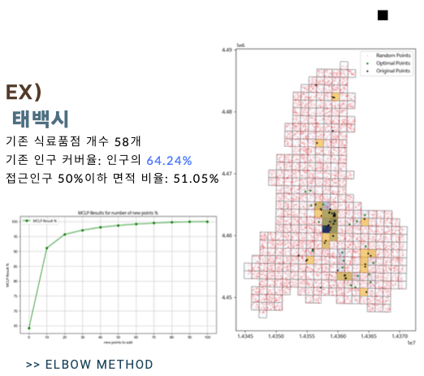
   * 결과:
     * 태백시:
     * 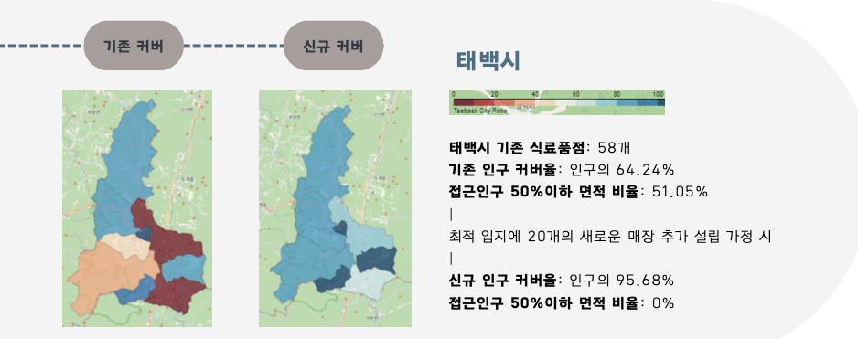
     * 양양군:
     * 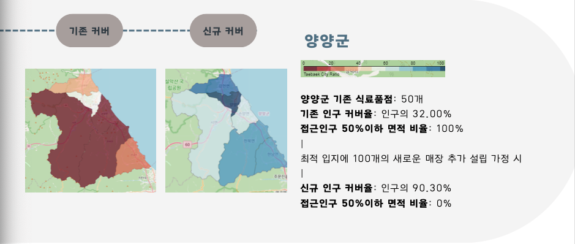
     * 원주시:
     * 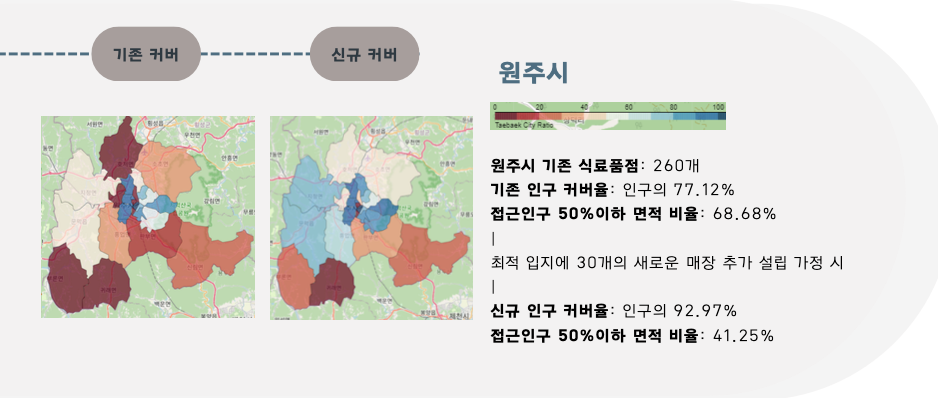

5. 최적 경로 모델링
   * 최종 선택된 정차 위치들을 가장 효율적으로 방문할 수 있는 경로 도출 필요.
   * TSP 알고리즘이란? TSP(Traveling Salesman Problem)는 특정 도시를 출발하여 다른 도시들을 한 번씩만 들린 후, 다시 출발한 곳으로 돌아오는 경로를 찾는 방법론.
   * 목표: 주어진 정점에서 출발하여, 그래프에 있는 각 정점을 정확하게 한 번만 방문하고, 출발한 정점으로 돌아오는 최단경로를 찾는 것이 목표
   * 과정: 클러스터별 경로 계산 및 총 거리 계산: 각 클러스터에 대해 TSP 경로를 계산하고, 이 경로들의 총 거리를 합계
   * 세부 과정:
     * osmnx 라이브러리를 활용해 각 지역의 세부 도로망 추출
     * 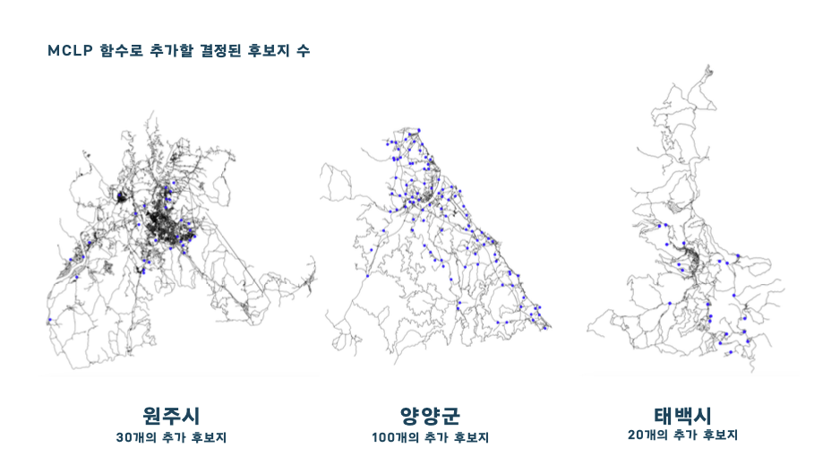
     * 루트 마다 정차 위치를 분배하기 위한 클러스터링 진행
     * 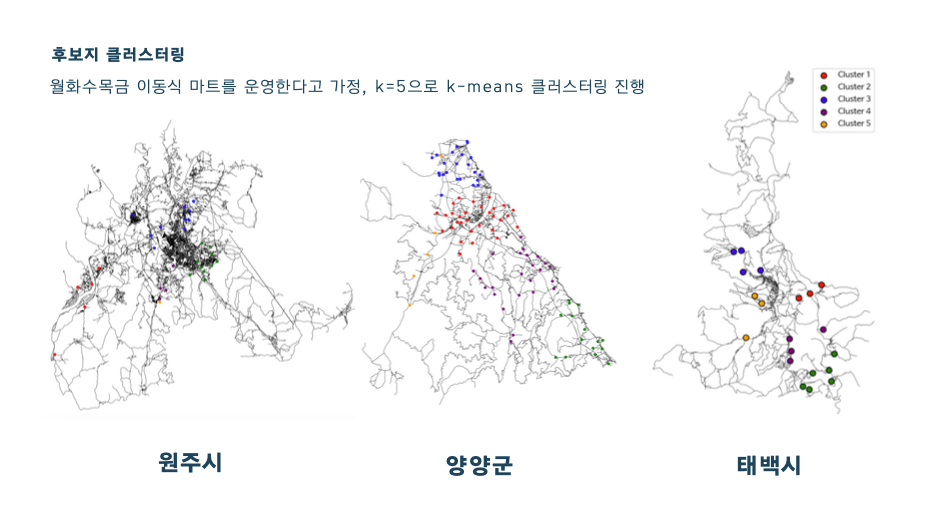
   * 결과:
     * 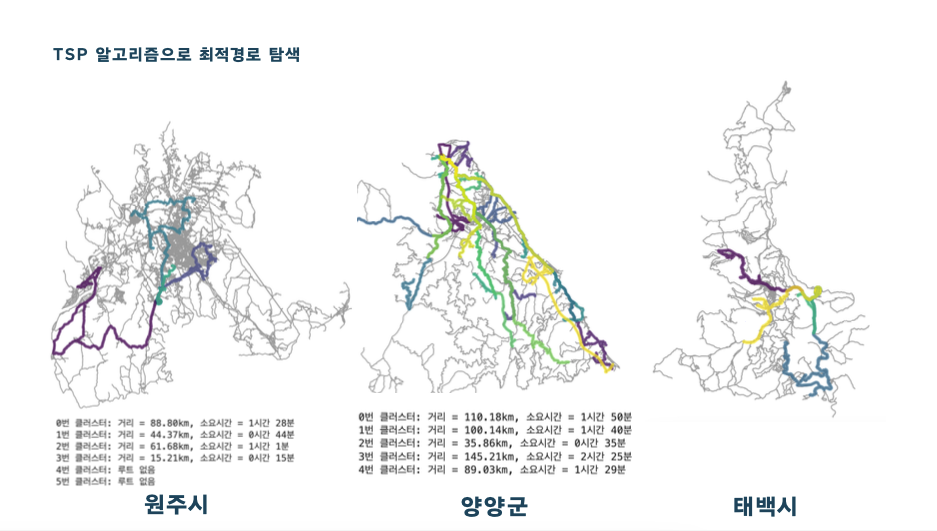
     * or-tools 라이브러리를 활용해 TSP 알고리즘 적용

#### 참고 문헌
* 이태동,2023-12-01,마트 없고 배송도 안돼…전국 곳곳 '식료품 사막’
https://news.nate.com/view/20231201n00868
* 윤소영,2024-02-02,“채소 사려면 두 시간”…‘식품 사막’된 농촌마을
https://news.kbs.co.kr/news/pc/view/view.do?ncd=7881991
* 성태경,이수기. (2021). 서울시 근린지역 식품환경의 접근성 변화와 식품사막 현상 분석 : 저소득 고령자 밀집 지역을 중심으로. Journal of Korea Planning Association, 56(1), 137-155.
https://www.riss.kr/link?id=A107304247
* 권채원, 유승미, 이단비, 임수지, 황선영. (2022). 서울시 수소충전소 최적입지 선정.
https://www.bigdata-map.kr/datastory/new/story_42
* 서울특별시 빅데이터캠퍼스(2023). 서울시 취약시간 의료 접근성 확대를 위한 공공심야약국 최적입지 선정
https://youtu.be/Zh9XR3akTOc?si=p4GxSjyUOHHEwhdD
* 공간발굴단,2022-01-13, 스마트 버스정류장 입지선정
https://spatial.tistory.com/24

  

### 결론 및 제언
#### 결론 및 시사점
* 분석 리소스의 한계로 전국적인 분석은 불가했지만, 전국 어느 지역에나 대입 가능한 방법론 도출.
* 분석 대상 지역의 경우, 뚜렷한 식품사막화 현상 확인.
* 생각보다 적은 수의 이동마트 정차로도 유의미한 개선이 가능하다는 것을 확인.

#### 주제에 대한 제언
* 이번 프로젝트를 통해 얻은 결론은 다음과 같다.
* 첫째, 우리의 생각보다 사막 현상은 심각함.
* 둘째, 생각보다 적은 비용으로 사막 현상을 유의미하게 개선할 수 있음.
* 떠올려보면, 우리는 평소에 한국이 너무 좁다거나 서울에 왜 이렇게 사람이 많냐는 소리를 입에 달고 산다.
* 하지만 막상 비수도권으로 내려가면 기본 인프라조차 갖추어지지 않은 도시가 태반.
* 과연 누가 "지방"으로 내려가서 "살아줄" 것인지 고민해 봐야 할 것.

#### 분석에 대한 제언
* 인구 격자 데이터는 방대한 규모이기 떄문에, 우리가 가진 리소스로 충분히 다루기가 어려웠다.
* 세밀한 분석을 위해서는 250m x 250m 격자를 사용하는 것이 정확하겠으나, 현실적으로 데이터를 구할 수 없었다.
* 1km x 1km 역시 전국 단위로 본다면 12만개의 공간 데이터프레임을 다뤄야 하는 만큼 과도한 시간이 필요했다.
* 강원도 전체 분석을 위해서도 colab 기준 수십 분이 소요되어, 더 자세한 분석을 진행하지 못한 점이 아쉽다.
* 버퍼 기준을 600m로 설정한 것도 아쉬운 부분인데, 1km 격자에 대응하기 위해 어쩔 수 없이 설정하였으나 이 역시 현실적으로 가장 적합하다고 보기에는 어렵다.
* 선행연구에서는 식품 사막의 경계를 걸어서 10~15분 이내, 즉 반경 1km로 보는데, 인구 격자의 한계상 버퍼를 1km로 설정하면 격자 외곽 포인트의 경우 커버리지를 과대 계산하는 문제가 있었다.
* 따라서 1km 격자의 대각선 길이를 고려하여 600m로 설정하였으나, 이는 다소 분석자의 편의를 위한 가정이다.
* MCLP 알고리즘을 선형계획법으로 풀어낸 것은 효율적이었다고 생각하나, 도로망을 MCLP 단계에서부터 고려하지 못한 점은 아쉽다.
* 다만 이는, 현재 구할 수 있는 도로망 데이터는 큰 도로만 담고 있어 어쩔 수 없는 면이 있으며, 이는 MCLP로 구한 포인트를 간선 도로의 가장 가까운 지점에 대응함으로서 해결했다.
* TLS 알고리즘 역시 리소스의 한계로 제대로 분석하지 못해 아쉽다.
* 외판원 문제(TLS)는 지점이 많을수록 계산량이 급격하게 올라가기 떄문에, 이번 프로젝트에서는 제대로 작동하지 못했다.
* 거리 배열과 클러스터링을 통해 우회적으로 경로를 구하기는 하였으나, 이는 최적해를 보장하지 못한다.

#### 프로젝트 성과
🏆 중앙대학교 데이터분석 학회 DartB 2024-1 제 2회 학술제 대상 수상(2024.05.29.)

#### 향후 연구 방향
* 충분한 성능을 낼 수 있는 로컬 환경 및 더 자세한 데이터를 확보한다면 이번 프로젝트보다 더 좋은 성과를 낼 수 있으리라 생각하며,
* 이번 프로젝트에서는 방법론을 내는데에 집중한만큼, 해당 방법론을 통해 전국적인 분석 또한 가능할 것으로 기대한다.

